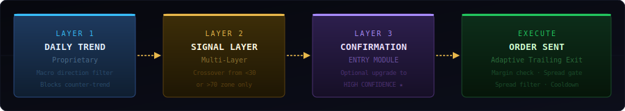
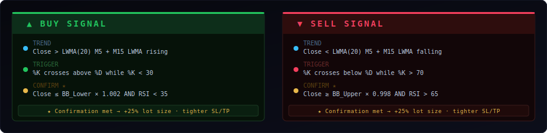
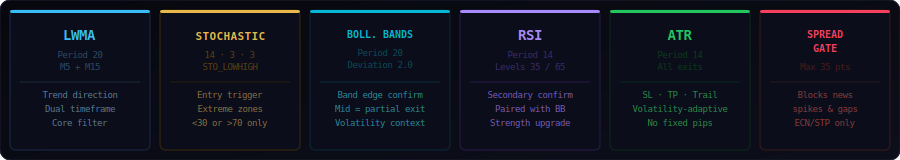
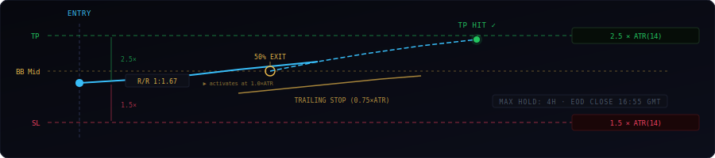
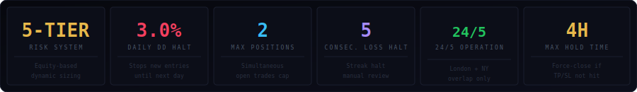

# 🥇 ScalpGold Sniper EA
### Evidence-Based XAUUSD M5 Scalping System for MetaTrader 5

> **This repository documents the strategy architecture and technical design of ScalpGold Sniper EA.**  
> Source code is proprietary and not distributed here.  
> The compiled EA is available on [MQL5 Market →](https://www.mql5.com/en/market/product/168064)

---

## Overview

ScalpGold Sniper is a fully automated Expert Advisor for MetaTrader 5, designed to scalp XAUUSD on the M5 timeframe. The strategy was developed through systematic review of peer-reviewed academic literature in quantitative trading, combined with an MSc-level background in Economics & Finance.

The design philosophy prioritizes **evidence over optimization**: every indicator, parameter, and exit mechanism was selected based on published empirical results on gold and FX markets — not curve-fitting to historical data.

---

## How a Signal is Generated

A trade requires three sequential layers to align. Each layer acts as a gate — if any layer fails, no order is placed.

| Layer | Indicator | Condition |
|---|---|---|
| 1 — Trend | M15 LWMA(20) | Slope direction agrees with M5 signal |
| 2 — Trigger | Stochastic(14,3,3) | Crossover from extreme zone (<30 or >70) |
| 3 — Confirm ★ | BB(20,2) + RSI(14) | Band touch + RSI extreme (optional upgrade) |

---

## Entry Conditions

**Strength Levels:**
- **Standard (2)** — Layers 1 + 2 met → base lot size
- **High Confidence (3)** — All 3 layers met → +25% lot size, tighter SL/TP multipliers

---

## Indicator Stack

| Indicator | Settings | Role |
|---|---|---|
| LWMA | Period 20, M5 + M15 | Trend direction, dual-timeframe |
| Stochastic | 14 · 3 · 3, STO_LOWHIGH | Entry trigger from extreme zones |
| Bollinger Bands | Period 20, Dev 2.0 | Confirmation + partial exit level |
| RSI | Period 14, levels 35/65 | Secondary confirmation |
| ATR | Period 14 | All exit distances (adaptive) |
| Spread Gate | Max 35 points | Blocks news spikes and illiquidity |

---

## Exit System

All exits are expressed as multiples of ATR(14), adaptive to gold's current volatility:

| Exit | Value | Notes |
|---|---|---|
| Stop Loss | 1.5 × ATR | Adaptive — scales with volatility |
| Take Profit | 2.5 × ATR | R:R 1:1.67, breakeven at 37.5% win rate |
| Trailing activation | 1.0 × ATR profit | Locks in gains after meaningful move |
| Trailing distance | 0.75 × ATR | Tight enough to preserve most profit |
| Partial close | 50% at BB midline | Early partial capture on reversion |
| Max hold time | 4 hours | Force-exit if TP/SL not triggered |

---

## Risk Management

---

## Academic Foundation

| Paper | Authors | Key Finding | Role in EA |
|---|---|---|---|
| LWMA + Stochastic on XAU/USD M5 | Zarith Sofia et al. (2024) | **+232% annual**, 5-year GA-optimized backtest | Core entry logic |
| BB + RSI on MT5 Gold | Hutabarat et al. (2025) | **Profit Factor 3.92** on XAUUSD | Confirmation layer |
| GA-MSSR Optimization | Zhang & Khushi (2020) | Custom Sharpe-Sterling Ratio fitness | OnTester() criterion |
| d-Backtest PS | Vezeris et al. (2020) | 6:1 in-sample/OOS ratio optimal | Walk-forward design |

---

## Default Parameters

| Parameter | Default | Description |
|---|---|---|
| LWMA Period | 20 | M5 trend detection |
| Stoch K/D/Slowing | 14/3/3 | Momentum timing |
| Oversold / Overbought | 30 / 70 | Signal zone thresholds |
| BB Period / Deviation | 20 / 2.0 | Confirmation bands |
| RSI Period / Levels | 14 / 35–65 | Secondary confirmation |
| M15 LWMA Period | 20 | Higher TF filter |
| ATR Period | 14 | Volatility measurement |
| SL Multiplier | 1.5 | Stop = 1.5 × ATR |
| TP Multiplier | 2.5 | Target = 2.5 × ATR |
| Trail Activation | 1.0 | Activates at 1.0 × ATR profit |
| Trail Distance | 0.75 | Trails at 0.75 × ATR |
| Risk per Trade | 0.75% | Equity % per position |
| Max Daily DD | 3.0% | Daily halt threshold |
| Max Positions | 2 | Simultaneous open trades |
| Max Consec. Losses | 5 | Streak halt |
| Session GMT | 08:00 – 17:00 | Active window |
| Max Spread | 35 pts | Spread gate |

---

## Documentation

- [`docs/ARCHITECTURE.md`](docs/ARCHITECTURE.md) — Full technical breakdown of every component
- [`docs/SETUP.md`](docs/SETUP.md) — Installation, configuration, and 3-phase testing protocol
- [`CHANGELOG.md`](CHANGELOG.md) — Full version history v1.0 → v5.0

---

## Get the EA

**Available on MQL5 Market**  
Search: `Gold Scalper M5 LWMA Stochastic Sniper` by *Hatef Tabbakhian*

🔗 [View on MQL5 Market](https://www.mql5.com/en/market/product/168064)

---

## Author

**Hatef Tabbakhian**  
MSc Economics & Finance — University of Naples Federico II  
GitHub: [github.com/Leotaby](https://github.com/Leotaby)

---

> ⚠️ *Past backtest performance does not guarantee future results. Always test on a demo account before deploying live capital.*

---

*Built with evidence. Not with hope.*
